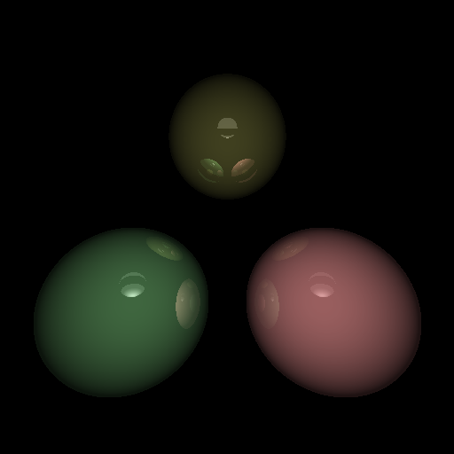
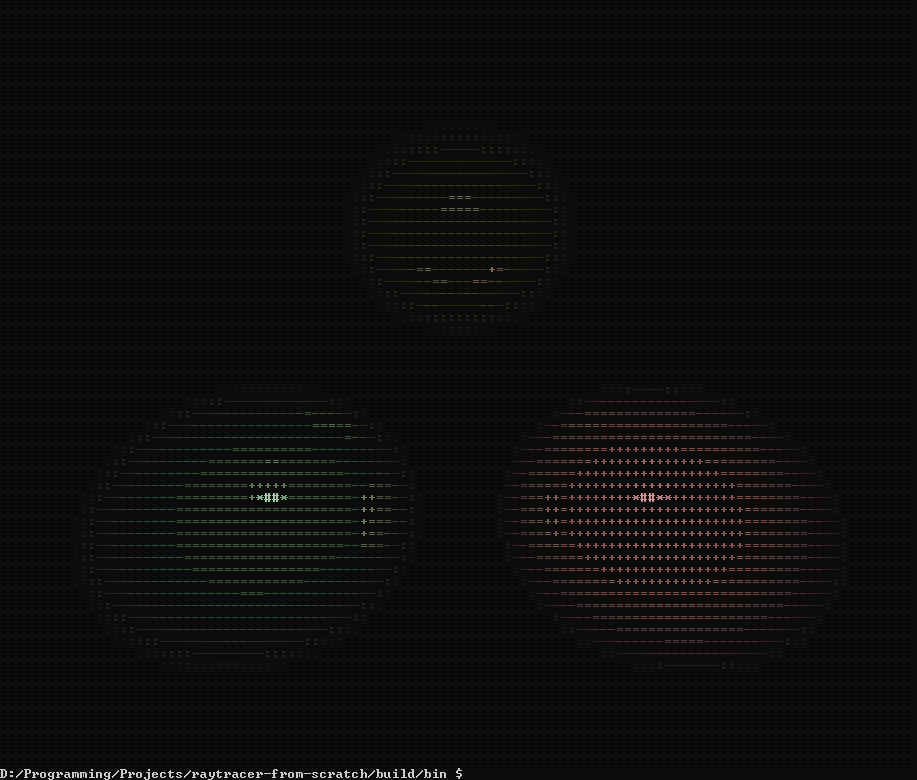

# raytracer-from-scratch

A raytracer which uses left-hand coordinate system and in which camera looks in `+Z` direction by default. Supports normal (pixel-based) and terminal-based rendering!





Features:
- Sphere primitive
- Variety of light sources (point, ambient, directional)
- Shininess
- Reflections

Visualization of the simple scene I made in GeoGebra: https://www.geogebra.org/calculator/zfexqajh

# Installation
```bash
clone https://github.com/fahlerile/raytracer-from-scratch
cd raytracer-from-scratch
mkdir build
cd build
cmake ..
make
cd bin
./raytracer
```

# Use

## CLI options
- `--help` - show help message
- `--terminal-rendering` - use terminal rendering

## Scene configuration

To configure your scene, you should change `scene.json` in `bin/` directory. All available primitives and light sources are listed in [`Sphere`](Sphere/) and [`Light`](Light/) header files. In your JSON file you should put the same arguments as requested in these primitives/light sources constructors.

## Example:

From [`Light/DirectionalLight/DirectionalLight.hpp`](Light/DirectionalLight/DirectionalLight.hpp)
```cpp
DirectionalLight(double intensity, color_t color, vec3d direction);
```
That means if you want your directional light to be white, 100% intense and to "look" in +Z direction, you should put this in your scene file (to be more precise, in `light_sources` section):
```json
{
    "type": "DirectionalLight",
    "intensity": 1,
    "color": [255, 255, 255, 255],
    "direction": [0, 0, 1]
}
```

## TODO/NOTES
New features:
- [ ] Clean-up `Scene` JSON constructor
- [ ] Add other primitives
    - [ ] Planes
    - [ ] Mathematical functions
    - [ ] Polygon
    - [ ] Cylinder
    - [ ] Cone
    - [ ] Torus
- [ ] Camera transform (camera matrix)
- [ ] Camera configuration in `scene.json`
- [ ] Real-time rendering, camera movement

Potential bug causes:
- [ ] `alpha` parameter is changing during `color_t` arithmetic (should it?)
